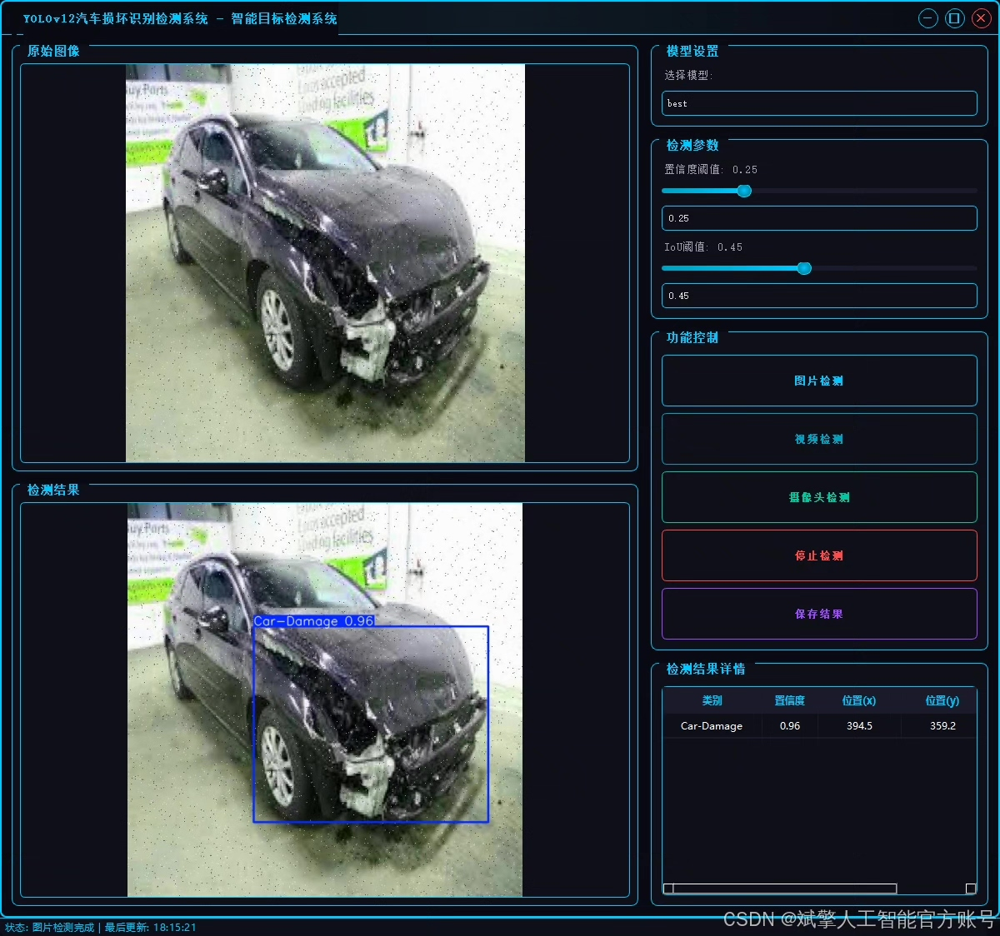
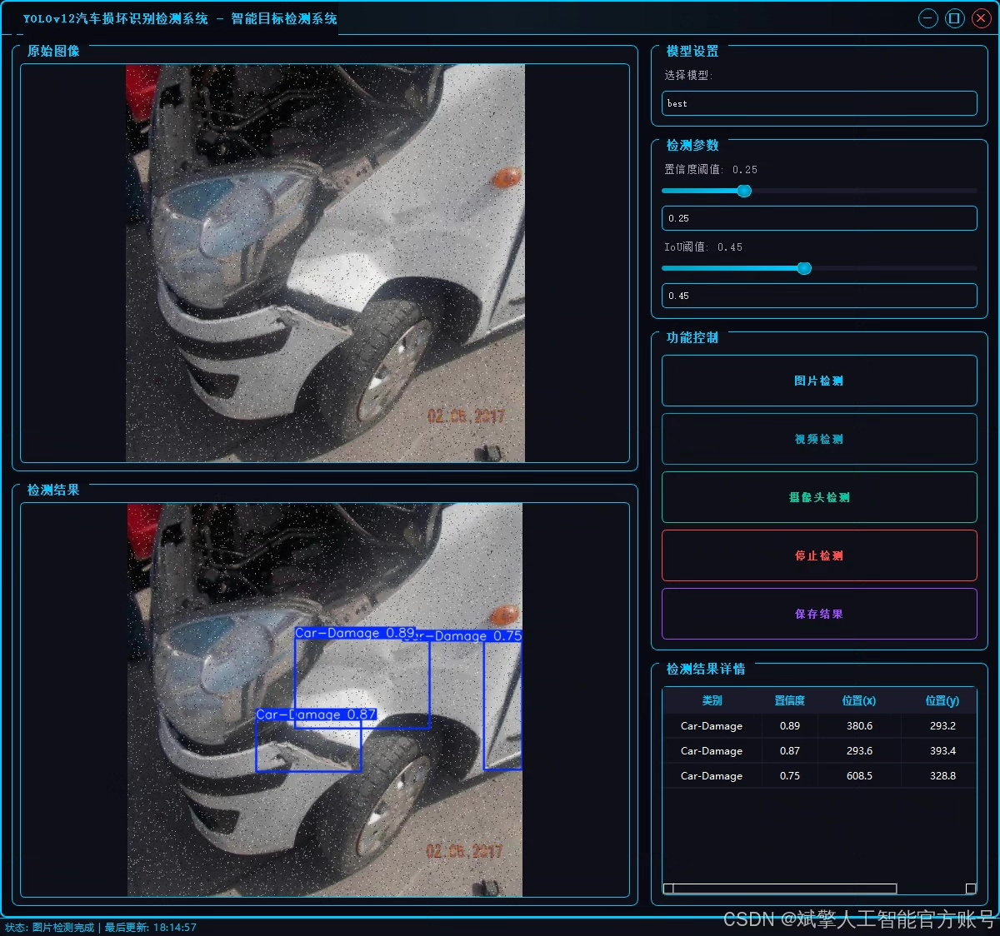
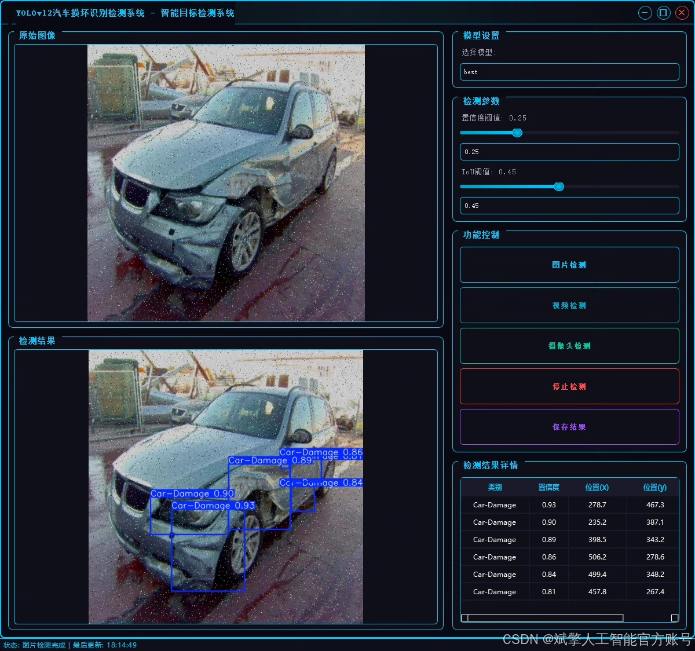
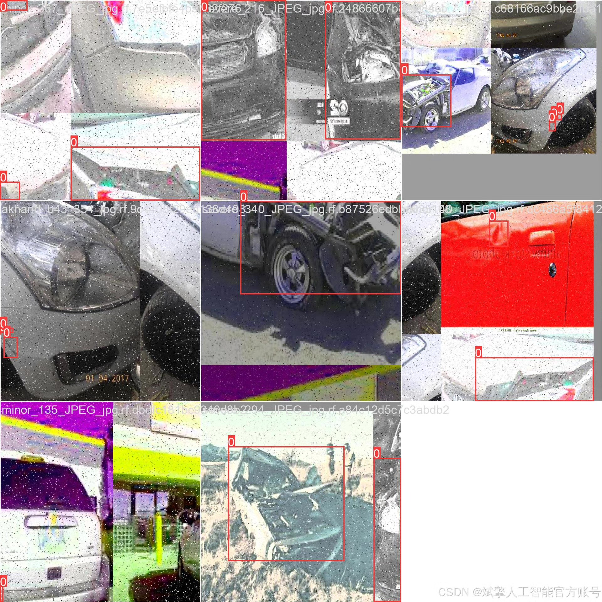
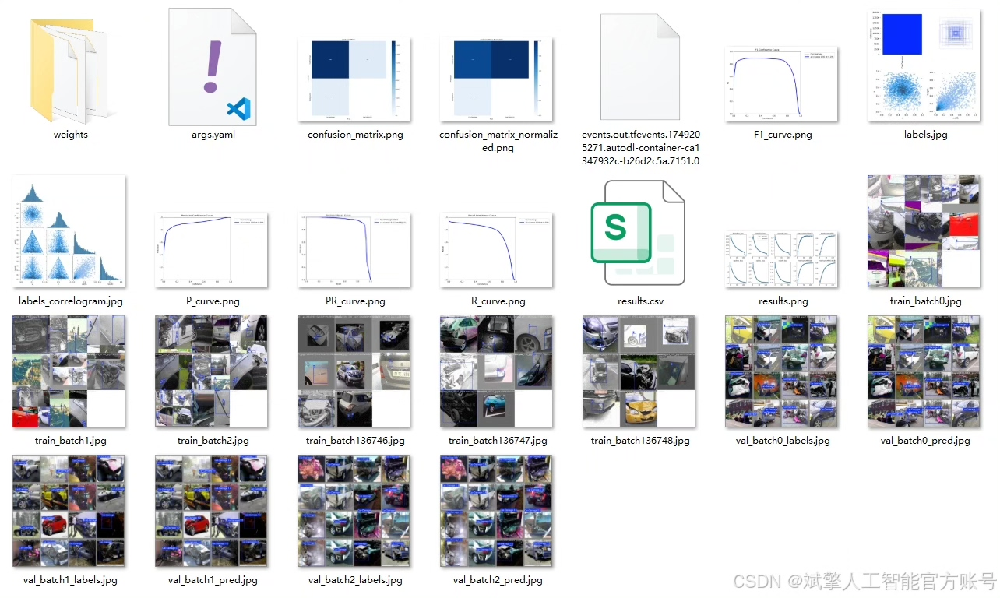
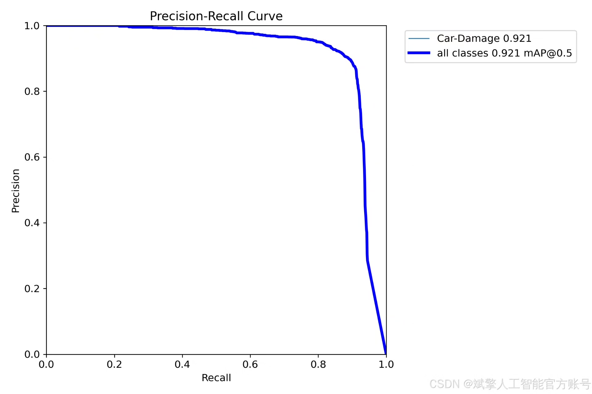
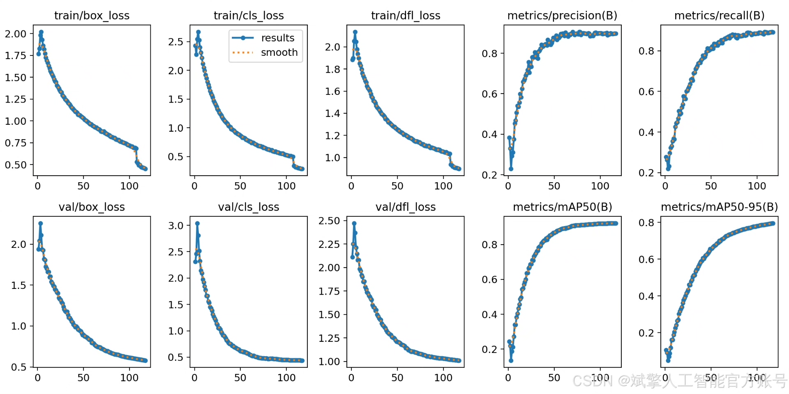
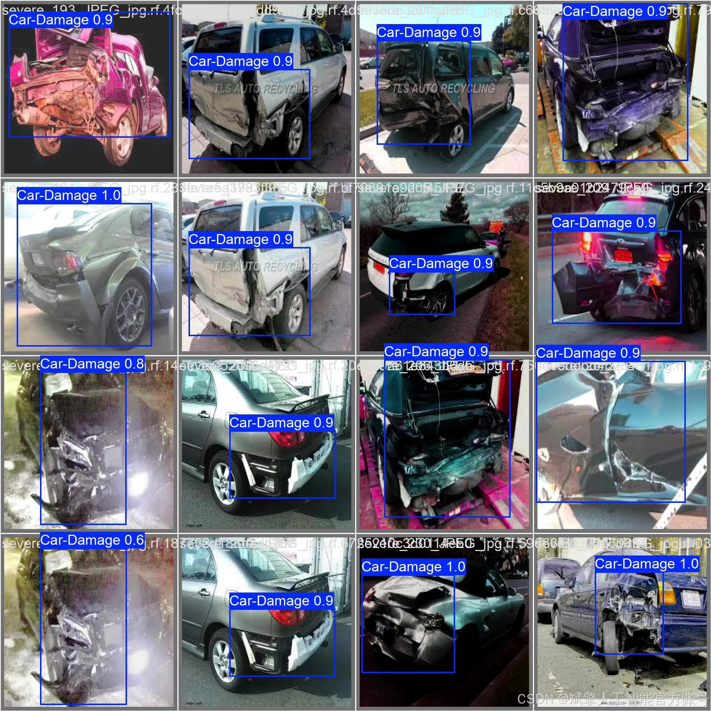
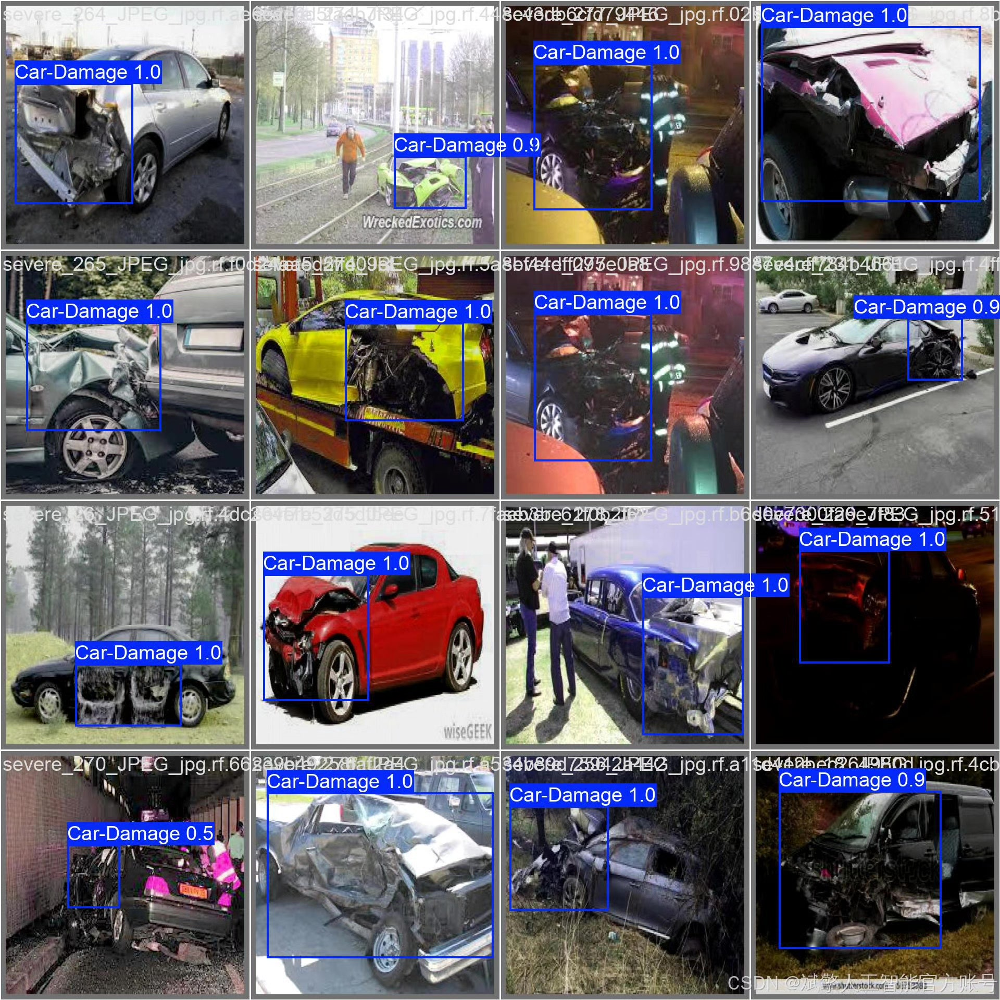

# YOLOv12 Automobile Damage Identification System

## Body

The success of this project highly depends on a large-scale, high-quality dedicated car damage dataset. The dataset has been meticulously collected and labeled as follows:
Detection Targets and Categories: The dataset is a single-class detection task, containing only one category: Car-Damage (汽车损坏). All damaged areas in the images (including but not limited to dents, paint scratches, bumper fractures, etc.) are precisely labeled with bounding boxes.
Data Size and Splitting: The total number of images in the dataset is 11,675. To follow best practices in machine learning and ensure that the model training does not overfit and can accurately evaluate its generalization capabilities, the data is divided into three parts.
✅ User Login and Registration: Supports password verification and security validation.
✅ Three Detection Modes: Based on the YOLOv12 model, supports image, video, and real-time camera detection, accurately identifying targets.
✅ Dual-Screen Comparison: Displays the original scene and detection results on the same screen.
✅ Data Visualization: Real-time table displays the category, confidence, and coordinates of the detected targets.
✅ Intelligent Parameter Tuning: Offers a confidence slide bar to dynamically optimize detection accuracy, adapting to different scene requirements.
✅ Sci-Fi Interactive Interface: Dark theme paired with dynamic light effects, reducing visual fatigue and improving operational experience.

## Images

## Payment

Here is a pay link on Stripe ( https://buy.stripe.com/3cs8yP7sY87d0vu9AB ). Please contact me lonlonago@foxmail.com after funding $89, and I will send you a complete data files , thank you!

